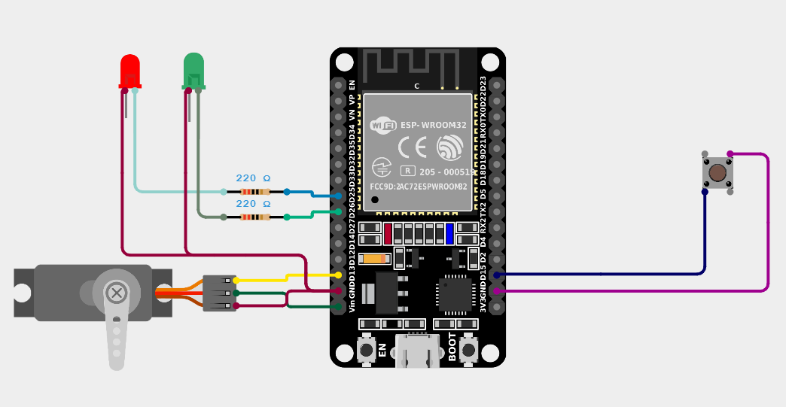

# ESP32-013-Magic-Trick-Box-with-ESP32🎩
Surprise your friends with this Magic Trick Box! Using an ESP32, servo motor, and LEDs, this project creates a fun interactive illusion where a secret mechanism unlocks the box only when the trick button is pressed.

---

## 🛠 Components Required

1. [ESP32 Development Board (30-pin)](https://robocraze.com/products/nodemcu-32-wifi-bluetooth-esp32-development-board30-pin?_pos=3&_psq=ESP32&_ss=e&_v=1.0)
2. [SG90 Micro Servo Motor](https://robocraze.com/products/sg90-micro-servo-motor?_pos=1&_psq=Servo+motor+%28SG90%29&_ss=e&_v=1.0)
3. [Push Button](https://robocraze.com/products/4-pins-dip-momentary-square-tactile-push-button-switch-10-pieces-6x6x5mm?_pos=1&_sid=7a5518733&_ss=r)
4. [Red LED](https://robocraze.com/products/3mm-red-led-pack-of-10?_pos=2&_sid=29237540e&_ss=r)
5. [Green LED](https://robocraze.com/products/3mm-green-led-pack-of-10?_pos=2&_sid=3b876becc&_ss=r)
6. [220Ω Resistor](https://robocraze.com/products/220-ohm-resistor-pack-of-10?_pos=1&_psq=220&_ss=e&_v=1.0)

---

## 🎥 Project Demo

👉 [Watch on Instagram](https://www.instagram.com/reel/DOli6xME6Yk/?igsh=bTIwOTJ6Zmt1MGNo)

---

## Circuit Diagram

---

